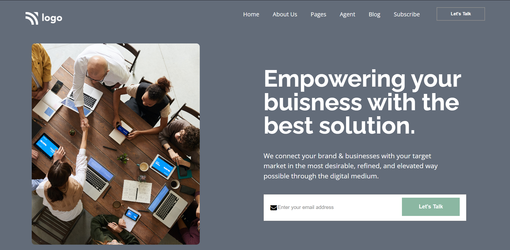

# Assignment 1

## Project 12 [Live Link](https://business-og.netlify.app)

-   Skills Gained in this project
    -   Learned about different units used for styling.
    -   Learned to divide the html document in different secitons.

---

## Time taken to finish this project

-   Approximately 13-14 hour taken to complete this one.

#### Screenshot

